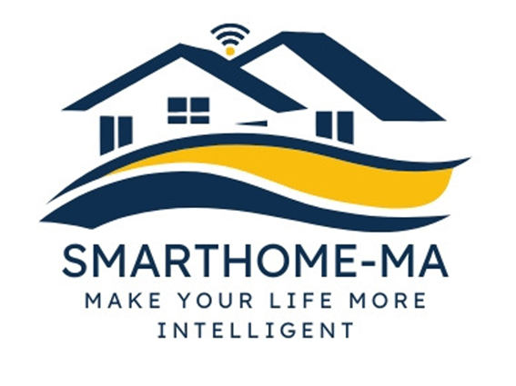
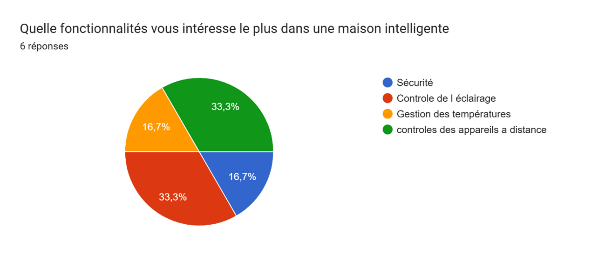
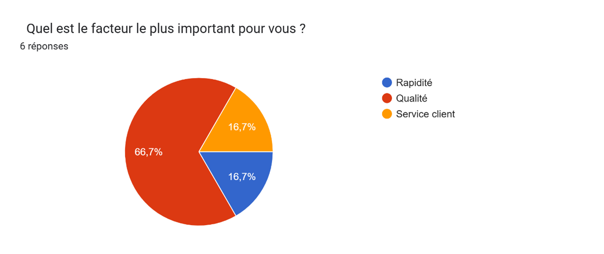
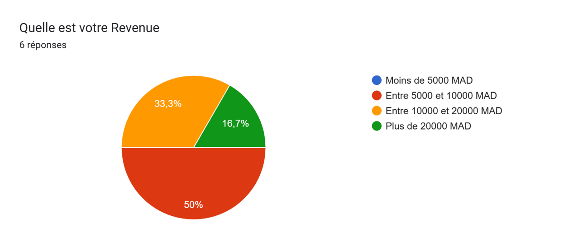
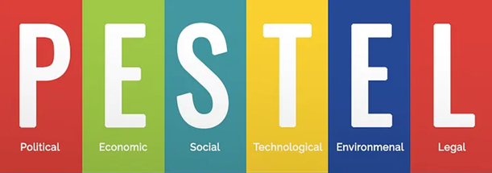
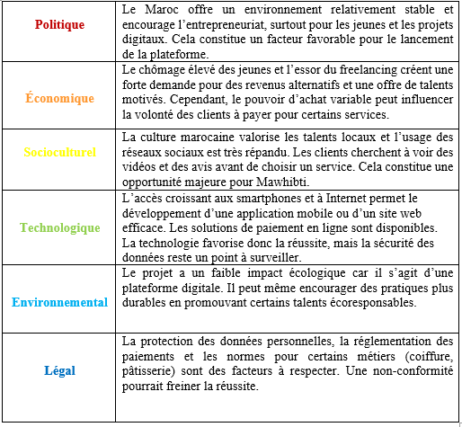
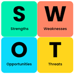
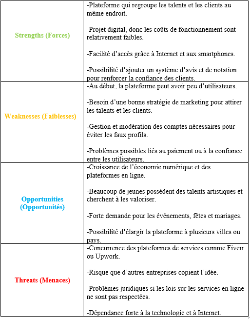
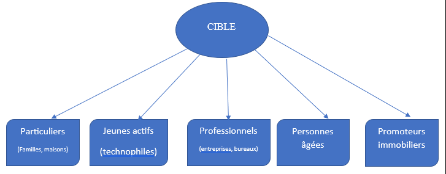
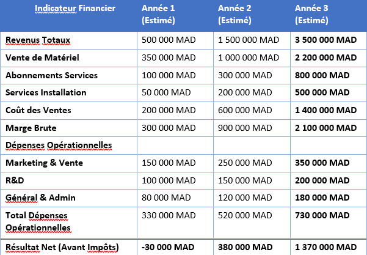

# 🏠 SMARTHOME-MA: Integrated IoT Ecosystem & Business Strategy
**"Make Your Life More Intelligent"** *A robust, integrated IoT ecosystem developed as part of the Entrepreneurship module at EST Casablanca.*

> **Final Entrepreneurial Report | Bachelor in Electronics, Automation & AI (IEAIA)**
> **Academic Year: 2025–2026 | EST Casablanca**

---

## 📑 Executive Summary
This project bridges the gap between **Embedded Systems Engineering (ESP32)** and the fundamental needs for domestic comfort, security, and energy efficiency. In the 2026 landscape, the Smart Home concept has transitioned from science fiction to an essential reality driven by the emergence of the Internet of Things (IoT).

   *Figure 1: Official SMARTHOME-MA Branding*

---

## 🔍 1. Problem Statement & Need Identification
### 1.1 Identified Gap
Current market solutions are often fragmented and fail to address user concerns regarding security and energy management.

* **Optimization Issues:** Existing systems lack personalization and require manual intervention for routine tasks.
* **Security Risks:** Traditional solutions lack real-time monitoring and intelligent alerts.
* **Energy Inefficiency:** Users struggle to analyze and optimize consumption, leading to high environmental impact.

### 1.2 Quantitative Market Validation
Based on our 2026 survey of urban residents in Casablanca:
* **83.3%** of respondents expressed direct interest in a Smart Home solution.
* **33.3%** prioritize remote device control, while **16.7%** focus specifically on security.
* **66.7%** of the target audience values **Quality** as the most important decision factor.

  
   
  

<i>Market Research Data: Interest Levels, Functional Needs, and Quality Drivers</i>

---

## 💡 2. The Solution: Integrated IoT Platform
We propose a digital ecosystem dedicated to the professional and secure management of residential environments.

### 2.1 Core Functionalities
* **Centralized Control:** Manage lighting, HVAC, and appliances via a single mobile application.
* **Real-Time Sensing:** Immediate access to temperature, humidity, air quality, and motion data.
* **Predictive Automation:** Scenario creation based on user habits (e.g., pre-arrival climate control).
* **Hardware Backbone:** Robust integration using **ESP32 microcontrollers**.

---

## 🛡️ 3. Security & Intellectual Property (IP) Strategy
To protect this intangible strategic asset, we implemented a multi-layered security approach:

### 3.1 Legal & Technical Protection
* **Trademark:** Registration of the "SMARTHOME-MA" brand with **OMPIC**.
* **Legals:** Systematic use of **NDAs** for all partnership and investor exchanges.
* **Firmware:** Implementation of **Flash Encryption** and **Secure Boot** for the ESP32 hardware.
* **Communication:** End-to-end encryption using **TLS/SSL** and **WPA3** protocols.

---

## 📈 4. Strategic Feasibility Study

### 4.1 PESTEL Analysis (Morocco 2026)

* **Political/Economic:** Stable environment for digital entrepreneurship; high demand for energy-saving tech.
* **Technological:** Generalization of 5G and high smartphone penetration in urban centers.
* **Legal:** Full compliance with emerging IoT security and data privacy regulations.

### 4.2 SWOT Diagnostic

| **STRENGTHS** | **WEAKNESSES** |
| :--- | :--- |
| ESP32/IoT technical expertise | Initial brand awareness to build |
| Low operating structure costs | Dependence on component imports |
| **OPPORTUNITIES** | **THREATS** |
| Growth of Morocco's digital economy | Global giants (Xiaomi, Google) |
| Expansion into B2B (Hotels/Offices) | Rapidly evolving tech standards |

---

## 💰 5. Business Model & Financial Forecasts
Our revenue model combines hardware sales with recurring service subscriptions.

### 5.1 Financial Projections (MAD)
| Financial Indicator | Year 1 (Invest) | Year 2 (Profit) | Year 3 (Scale) |
| :--- | :--- | :--- | :--- |
| **Total Revenue** | 500,000 | 1,500,000 | 3,500,000 |
| **Hardware Sales** | 350,000 | 1,000,000 | 2,200,000 |
| **Net Result (Pre-Tax)**| **-30,000** | **+380,000** | **+1,370,000** |

---

## 🤝 Team & Acknowledgements
* **Lead Engineer:** Mohamed Amine Ouklilane
* **Strategic Development:** Achraf El Youssefi & Soufiane El Aboudi
* **Academic Supervision:** Pr. Kaoutar Elyoukdi

---

### 📄 Full Documentation
[👉 Click here to access the full 30-page Technical Report (PDF)](./Rapport_Final_Smart_Home.pdf)
